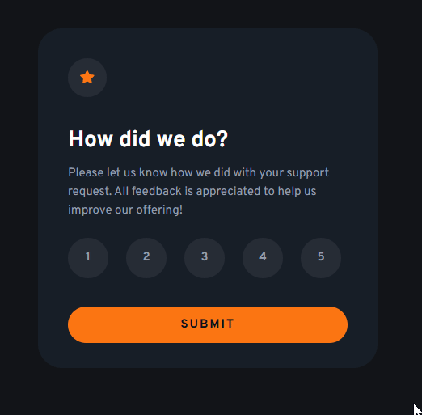

# 🌟 Interactive Rating Component

Projeto de componente visual de **Avaliação Interativa**, desenvolvido como parte de um desafio do **Frontend Mentor**. O objetivo foi criar um cartão de avaliação com interações em tempo real, focando em responsividade, usabilidade e feedback visual imediato ao usuário.

---

## 📌 Desafio

Construir um componente funcional de avaliação baseado no layout proposto, contendo:

- Ícone decorativo no topo do card;
- Texto introdutório com explicação da funcionalidade;
- Botões numéricos de 1 a 5 para seleção da nota;
- Botão de envio e tela de agradecimento com feedback da nota selecionada;
- Comportamento dinâmico entre os estados de avaliação e resultado;
- Layout responsivo.

---

## ⚙️ Funcionalidades

- Feedback visual ao selecionar uma nota;
- Alternância entre tela de avaliação e mensagem de agradecimento;
- Retorno visual com a nota selecionada;
- Botão de retorno à tela de avaliação;
- Estilização com foco em contraste e legibilidade;
- Estilos e tamanhos adaptáveis via media queries.

---

## 🛠️ Tecnologias Utilizadas

- **HTML5**
- **CSS3**
- **JavaScript (DOM Manipulation)**

---

## 🖼️ Resultado

### 🖥️ Desktop e 📱 Mobile

---

## 🔗 Veja no GitHub Pages

🔗 [Clique aqui para visualizar o projeto](https://inocenciooo.github.io/interactive-rating/)
